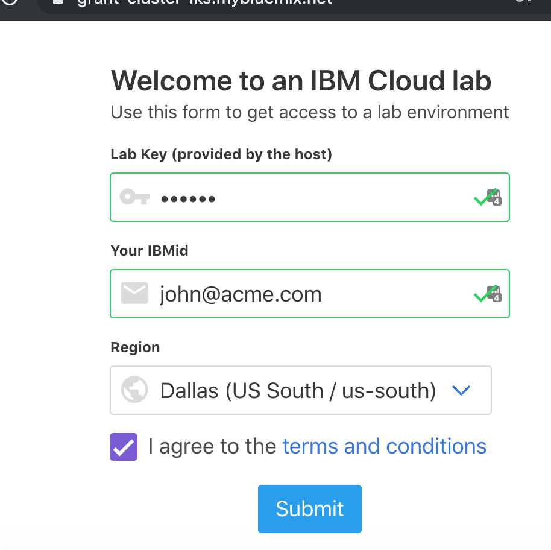

# Get Started
In this section, you will create your own IBM Cloud account, and then get access to a IBM Cloud Lab account which contains pre-provisioned clusters. Each lab attendee will be granted access to one cluster.

## Create an IBM Cloud Account and Get Access to Your Cluster
1. Create your own [IBM Cloud account](TODO:VCPIURL).
2. After the email verification, confirm by logging in to https://cloud.ibm.com
3. Go to the [Get Cluster](TODO:GETCLUSTER) web page and enter your IBM ID (the email you used to sign up), the lab key from the instructor, and select the `eu-fra` region.

    

3. You will be added to the IBM Lab account and granted access to a cluster. Note the name of your cluster. It will be something like: `kubelab-01`
4. Refresh your [IBM Cloud Dashboard](https://cloud.ibm.com)
5. Switch to the **IBM** account by clicking on the account selection drop down in the top nav bar.
6. Click on **Kubernetes Clusters** in the Resource Summary tile.

    

7. Under **Kubernetes Clusters**, click on the cluster that has been assigned to you.

    

8. This page has some overview information about your cluster.

You will use this cluster for this lab. Note the name of your cluster. Note that this is a *Standard/Paid* cluster (as opposed to FREE cluster.)

Continue on to [exercise 1](../exercise-1/README.md).

## Accessing your Kubernetes Cluster

## Connect to your cluster using the Cloud Shell

For this lab, a hosted shell is provided for you with all the necessary tools installed. Use this web shell to perform the tasks in this lab.

1. Using Chrome or Firefox, go to the [Cloud Shell](https://cloudshell-console-ikslab.us-south.cf.cloud.ibm.com/) and login using the Login button, using the password from the instructor. You may already be logged in, if so skip to the next step.
2. Using the account drop down, choose the `IBM` account.
3. Click on the Terminal icon to launch your web shell.


## Access your cluster
Learn how to set the context for your cluster in your CLI. Every time you log in to the CLI to work with the cluster, you must run this command to set a path to the cluster's configuration file as a session variable. The Kubernetes CLI uses this variable to find a local configuration file and certificates that are necessary to connect with the cluster in IBM Cloud.

1. List the available clusters.

    ```shell
    ibmcloud ks clusters
    ```

    > Note: If no clusters are shown, make sure you are targeting the right region with `ibmcloud ks region-set`. Choose the same region that you chose when creating the cluster on the [Get Cluster](https://get-cluster.mybluemix.net/) page.

2. Export your cluster name as an environment variable:

    ```shell
    export MYCLUSTER=<your_cluster_name>
    ```

3. Get some information about your cluster:

    ```shell
    ibmcloud ks cluster-get $MYCLUSTER
    ```

4. Download the configuration file and certificates for your cluster using the `cluster-config` command.

    ```shell
    ibmcloud ks cluster-config $MYCLUSTER
    ```

5. Copy and paste the output command from the previous step to set the `KUBECONFIG` environment variable and configure your CLI to run `kubectl` commands against your cluster.

    Example:
    ```shell
    export KUBECONFIG=/Users...
    ```

6. Validate access to your cluster by viewing the nodes in the cluster.

    ```shell
    kubectl get node
    ```
    
Continue on to [exercise 2](../exercise-2/README.md).