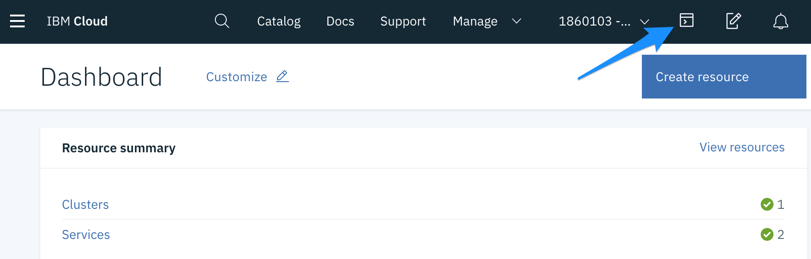
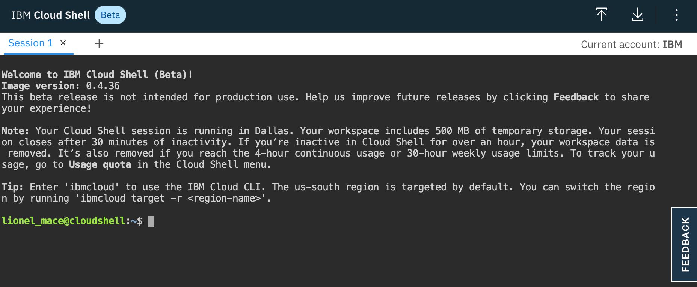

# Accessing your Kubernetes Cluster

## Connect to your cluster using the Cloud Shell

The IBM Cloud Shell is preconfigured with the full IBM Cloud CLI and tons of plug-ins and tools that you can use to manage apps, resources, and infrastructure.

1. In the IBM Cloud Console menu bar, click the IBM Cloud Shell icon to start a session

    

2. A session starts and automatically logs you in through the IBM Cloud CLI.

    


## Access your cluster
Learn how to set the context for your cluster in your CLI. Every time you log in to the CLI to work with the cluster, you must run this command to set a path to the cluster's configuration file as a session variable. The Kubernetes CLI uses this variable to find a local configuration file and certificates that are necessary to connect with the cluster in IBM Cloud.

1. List the available clusters.

    ```shell
    ibmcloud ks clusters
    ```

    > Note: If no clusters are shown, make sure you are targeting the IBM account in the top right corner. 

2. For convenience, export your cluster name as an environment variable.  

    ```shell
    export MYCLUSTER=<your_cluster_name>
    ```

3. Get some information about your cluster:

    ```shell
    ibmcloud ks cluster get --cluster $MYCLUSTER
    ```

4. Download the configuration file and certificates for your cluster using the `ibmcloud ks cluster config` command. This downloads the necessary credentials for you to access your cluster.

    ```shell
    ibmcloud ks cluster config --cluster $MYCLUSTER
    ```

5. Validate access to your cluster by viewing the nodes in the cluster.

    ```shell
    kubectl get node
    ```
    
Continue on to [exercise 2](../exercise-2/README.md).
