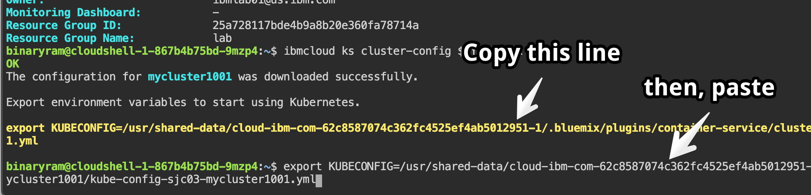

# Accessing your Kubernetes Cluster

## Connect to your cluster using the Cloud Shell

For this lab, a hosted shell is provided for you with all the necessary tools installed. Use this web shell to perform the tasks in this lab.

1. Using Chrome or Firefox, [click here to go to the Cloud Shell](https://cloudshell-console-ikslab.us-south.cf.cloud.ibm.com/) and login using the Login button, using the same password provided by the instructor. You may already be logged in, if so skip to the next step.
2. Using the account drop down, choose the `IBM` account.
3. Click on the Terminal icon to launch your web shell.


## Access your cluster
Learn how to set the context for your cluster in your CLI. Every time you log in to the CLI to work with the cluster, you must run this command to set a path to the cluster's configuration file as a session variable. The Kubernetes CLI uses this variable to find a local configuration file and certificates that are necessary to connect with the cluster in IBM Cloud.

1. List the available clusters.

    ```shell
    ibmcloud ks clusters
    ```

    > Note: If no clusters are shown, make sure you are targeting the IBM account in the top right corner. 

2. For convenience, export your cluster name as an environment variable.  

    ```shell
    export MYCLUSTER=<your_cluster_name>
    ```

3. Get some information about your cluster:

    ```shell
    ibmcloud ks cluster-get $MYCLUSTER
    ```

4. Download the configuration file and certificates for your cluster using the `cluster-config` command. This downloads the necessary credentials for you to access your cluster.

    ```shell
    ibmcloud ks cluster-config $MYCLUSTER
    ```

5. The previous command should output an export command. *Copy this export line and paste it in to the prompt.* This will set the `KUBECONFIG` environment variable and configure your `kubectl` CLI to run commands against your cluster.

    Example:
    ```shell
    export KUBECONFIG=/Users...
    ```


6. Validate access to your cluster by viewing the nodes in the cluster.

    ```shell
    kubectl get node
    ```
    
Continue on to [exercise 2](../exercise-2/README.md).
