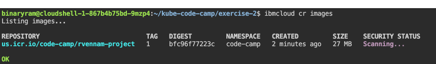

# Set up and deploy your first application

Learn how to push an image of an application to IBM Cloud Container Registry and deploy a basic application to a cluster.

## Build and Push an image to IBM Cloud Container Registry

To push an image, we first must have an image to push. We have
prepared several `Dockerfile`s in this repository that will create the
images. We will be running the images, and creating new ones, in the
later labs. 

This lab uses the Container Registry built in to IBM Cloud, but the
image can be created and uploaded to any standard Docker registry to
which your cluster has access.

1. Download a copy of this repository:

    ```
    git clone https://github.com/beemarie/kube-code-camp
    ```

2. Change directory to Exercise 2: 

   ```
   cd kube-code-camp/exercise-2
   ```

3. Take a look at the `app.js` and the `Dockerfile` files to see the application source and the image we are about to build. To view a file you need to click the pencil icon and click on **Files** on the left. Find the files under `kube-code-camp/exercise-2`. 

    

4. Ensure the region is set for the IBM Cloud Container Registry:

    ```
    ibmcloud cr region-set us-south
    ```

5. Login to IBM Cloud Container Registry, which will allow you to push images to the registry.

    ```
    ibmcloud cr login
    ```

6. Select a unique name for your project. **NOTE: This unique name must be all lowercase**. This could be something like `your-initials-app-somenumber`, or `bmv-app-1227`. Set this unique name as the MYPROJECT environment variable:
    ```
    export MYPROJECT=<UNIQUE_PROJECT_NAME>
    ```

7. A namespace has already been created in this container registry for use in the lab. Set the namespace variable as well as the registry environment variable.
    ```
    export MYNAMESPACE=code-camp
    export MYREGISTRY=us.icr.io
    ```
   
8. Build and tag (`-t`) the docker image and then push it to the IBM Cloud Container Registry, using the `ibmcloud cr build` command:
    ```
    ibmcloud cr build . -t $MYREGISTRY/$MYNAMESPACE/$MYPROJECT:1
    ```

9.  Verify the image is built: 

   ```
   ibmcloud cr images
   ```


This is your image in the IBM Cloud Container Registry. Next, you will reference this image when deploying an application to your Kubernetes cluster.

## Deploy your application

1. Start by running your image as a deployment: 

   ```
   kubectl run hello-world --image=$MYREGISTRY/$MYNAMESPACE/$MYPROJECT:1
   ```
2. Run `kubectl get deployments` to see the Deployment resource you just created.
3. Run `kubectl get pods` to check the Status of your pods.

   You should see output similar to the following:
   
   ```
   kubectl get pods
   NAME                          READY     STATUS              RESTARTS   AGE
   hello-world-562211614-0g2kd   0/1       ContainerCreating   0          1m
   ```

3. Once the status reads `Running`, expose that deployment as a service of type `NodePort` - accessed through the IP of the worker nodes.  The example for this lab listens on port 8080.  Run:

    ```
    kubectl expose deployment/hello-world --type="NodePort" --port=8080
    ```

1. To find the port used on that worker node, examine your new service: 

    ```
    kubectl describe service hello-world
    ```

1. Take note of the "NodePort:" line, and save the port number as an environment variable.  The port number will be just the number from this line. Something like `30585`.

    ```
    export NODEPORT=<your_port_here>
    ```

1. Note the **Public IP** for any one of the workers, which you can see from the following command:

    ```
    ibmcloud ks workers $MYCLUSTER
    ```

1. Save this IP as an environment variable

    ```
    export WORKER_IP=<your_ip_here>
    ```

1. You can now access your application using `curl` or in your web browser.

    ```
    curl $WORKER_IP:$NODEPORT
    ```
    
    If you see something like `Hello world from hello-world-86959dc89b-r6jjx! Your app is up and running in a cluster!` you're done with this exercise!

In this exercise, you built a docker image from a dockerfile. You then pushed that image to the IBM Cloud Container Registry. Finally, you deployed your application to Kubernetes, using the image stored in the container registry.

Continue on to [Exercise 3](../exercise-3/README.md)
