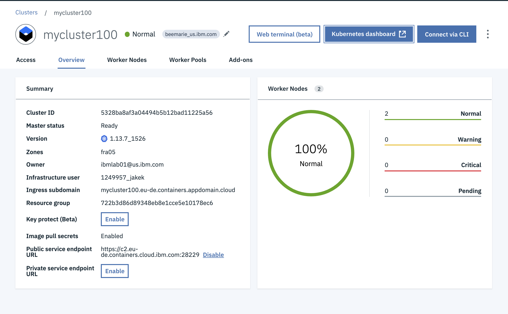

# Scale and update apps -- services, replica sets, and health checks

In this exercise, understand how to update the number of replicas a deployment has and how to safely roll out an update on Kubernetes. Learn, also, how to perform a simple health check.

For this exercise, you need a running deployment with a single replica.

## Scale apps with replicas

A *replica* is how Kubernetes accomplishes scaling out a deployment. A replica is a copy of a pod that already contains a running service. By having multiple replicas of a pod, you can ensure your deployment has the available resources to handle increasing load on your application.

1. `kubectl` provides a `scale` subcommand to change the size of an
   existing deployment. Let's us it to go from our single running
   instance to 10 instances.
   
   ``` console 
   kubectl scale --replicas=10 deployment hello-world
   deployment "hello-world" scaled
   ```

    Kubernetes will now act according to the desired state model, and attempt to make true the condition of 10 replicas. It will do this
    by starting new pods with the same configuration.

2. Let's see your changes being rolled out:
    
    ```
    kubectl rollout status deployment/hello-world
    ```

   The rollout might occur so quickly that the following messages might _not_ display:

    Expected Output:
    ```
    => kubectl rollout status deployment/hello-world
    Waiting for rollout to finish: 1 of 10 updated replicas are available...
    Waiting for rollout to finish: 2 of 10 updated replicas are available...
    Waiting for rollout to finish: 3 of 10 updated replicas are available...
    Waiting for rollout to finish: 4 of 10 updated replicas are available...
    Waiting for rollout to finish: 5 of 10 updated replicas are available...
    Waiting for rollout to finish: 6 of 10 updated replicas are available...
    Waiting for rollout to finish: 7 of 10 updated replicas are available...
    Waiting for rollout to finish: 8 of 10 updated replicas are available...
    Waiting for rollout to finish: 9 of 10 updated replicas are available...
    deployment "hello-world" successfully rolled out
    ```

5. Once the rollout has finished, ensure your pods are running by using: 

    ```
    kubectl get pods
    ```

   You should see output listing 10 replicas of your deployment:

    Expected Output:
    ```
    => kubectl get pods
    NAME                          READY     STATUS    RESTARTS   AGE
    hello-world-562211614-1tqm7   1/1       Running   0          1d
    hello-world-562211614-1zqn4   1/1       Running   0          2m
    hello-world-562211614-5htdz   1/1       Running   0          2m
    hello-world-562211614-6h04h   1/1       Running   0          2m
    hello-world-562211614-ds9hb   1/1       Running   0          2m
    hello-world-562211614-nb5qp   1/1       Running   0          2m
    hello-world-562211614-vtfp2   1/1       Running   0          2m
    hello-world-562211614-vz5qw   1/1       Running   0          2m
    hello-world-562211614-zksw3   1/1       Running   0          2m
    hello-world-562211614-zsp0j   1/1       Running   0          2m
    ```
   
**Tip:** The above step increases the number of replicas of your container within your cluster. Another way to improve availability is to grow your cluster by [adding nodes and regions](https://cloud.ibm.com/docs/containers?topic=containers-add_workers) to your cluster, as shown in the following diagram: 

 

## Update Apps

Kubernetes allows you to use a rollout to update an app deployment with a new Docker image.  This allows you to easily update the running image and also allows you to easily undo a rollout, if a problem is discovered after deployment.

In the previous lab, we created an image with a `1` tag. Let's make a version of the image that includes new content and use a `2` tag. This exercise also contains a `Dockerfile`. Let's build and push it up to our image registry.

To update:

1. Change directories to exercise 3:
    ```
    cd ../exercise-3/
    ```

1. Build the new docker image with a `2` tag, and push it to the IBM Cloud Container Registry using the `ibmcloud cr build` command:

    ```
    ibmcloud cr build . -t $MYREGISTRY/$MYNAMESPACE/$MYPROJECT:2
    ```
    Note that we are building the image with the same name, but different tag (2). If you run `ibmcloud cr images`, you will now see both of your images.


1. Using `kubectl`, you can now update your deployment to use the
   latest image. `kubectl` allows you to change details about existing
   resources with the `set` subcommand. We can use it to change the
   image being used.

    ```
    kubectl set image deployment/hello-world hello-world=$MYREGISTRY/$MYNAMESPACE/$MYPROJECT:2
    ```

    Note that a pod could have multiple containers, in which case each container will have its own name.  Multiple containers can be updated at the same time.  ([More information](https://kubernetes.io/docs/user-guide/kubectl/kubectl_set_image/).)

1. Run `kubectl rollout status deployment/hello-world` or `kubectl get replicasets` to check the status of the rollout. The rollout might occur so quickly that the following messages might _not_ display:

  Expected Output:
   ```
   => kubectl rollout status deployment/hello-world
   Waiting for rollout to finish: 2 out of 10 new replicas have been updated...
   Waiting for rollout to finish: 3 out of 10 new replicas have been updated...
   Waiting for rollout to finish: 3 out of 10 new replicas have been updated...
   Waiting for rollout to finish: 3 out of 10 new replicas have been updated...
   Waiting for rollout to finish: 4 out of 10 new replicas have been updated...
   Waiting for rollout to finish: 4 out of 10 new replicas have been updated...
   Waiting for rollout to finish: 4 out of 10 new replicas have been updated...
   Waiting for rollout to finish: 4 out of 10 new replicas have been updated...
   Waiting for rollout to finish: 4 out of 10 new replicas have been updated...
   Waiting for rollout to finish: 5 out of 10 new replicas have been updated...
   Waiting for rollout to finish: 5 out of 10 new replicas have been updated...
   Waiting for rollout to finish: 5 out of 10 new replicas have been updated...
   Waiting for rollout to finish: 6 out of 10 new replicas have been updated...
   Waiting for rollout to finish: 6 out of 10 new replicas have been updated...
   Waiting for rollout to finish: 6 out of 10 new replicas have been updated...
   Waiting for rollout to finish: 7 out of 10 new replicas have been updated...
   Waiting for rollout to finish: 7 out of 10 new replicas have been updated...
   Waiting for rollout to finish: 7 out of 10 new replicas have been updated...
   Waiting for rollout to finish: 7 out of 10 new replicas have been updated...
   Waiting for rollout to finish: 8 out of 10 new replicas have been updated...
   Waiting for rollout to finish: 8 out of 10 new replicas have been updated...
   Waiting for rollout to finish: 8 out of 10 new replicas have been updated...
   Waiting for rollout to finish: 8 out of 10 new replicas have been updated...
   Waiting for rollout to finish: 9 out of 10 new replicas have been updated...
   Waiting for rollout to finish: 9 out of 10 new replicas have been updated...
   Waiting for rollout to finish: 9 out of 10 new replicas have been updated...
   Waiting for rollout to finish: 1 old replicas are pending termination...
   Waiting for rollout to finish: 1 old replicas are pending termination...
   Waiting for rollout to finish: 1 old replicas are pending termination...
   Waiting for rollout to finish: 9 of 10 updated replicas are available...
   Waiting for rollout to finish: 9 of 10 updated replicas are available...
   Waiting for rollout to finish: 9 of 10 updated replicas are available...
   deployment "hello-world" successfully rolled out
   ```

   ```
   => kubectl get replicasets
   NAME                   DESIRED   CURRENT   READY     AGE
   hello-world-1663871401   9         9         9         1h
   hello-world-3254495675   2         2         0         <invalid>
   => kubectl get replicasets
   NAME                   DESIRED   CURRENT   READY     AGE
   hello-world-1663871401   7         7         7         1h
   hello-world-3254495675   4         4         2         <invalid>
   ...
   => kubectl get replicasets
   NAME                   DESIRED   CURRENT   READY     AGE
   hello-world-1663871401   0         0         0         1h
   hello-world-3254495675   10        10        10        1m
   ```

1. Confirm your new code is active:

    ```
    curl $WORKER_IP:$NODEPORT
    ```

You should see something like: `Hello world from hello-world-86959dc89b-hgzs8! Great job getting the second stage up and running!`

Congratulations - You just updated your app with a new version!

## Launch the Kubernetes Dashboard

1. Go back to your clusters detail page in the IBM Cloud UI. If you don't still have this open, you can go the [clusters](https://cloud.ibm.com/kubernetes/clusters/) page and select your cluster.

2. Click the Kubernetes Dashboard button.

    


## Explore the Kubernetes Dashboard

1. In the **Workloads** tab, you can see the resources that you created. From this tab, you can continually refresh and see that the health check is working. 

2. In the **Pods** section of the **Workloads** tab you can see how many times the pods are restarted when the containers in them are re-created. You might happen to catch errors in the dashboard, indicating that the health check caught a problem. Give it a few seconds and refresh again. You see the number of restarts changes for each pod.

3. Feel free to explore the dashboard a bit.

## Roll Back Apps
1. Imagine you identified a defect with the version 2 of your application! Let's undo this latest rollout. You can do so with the `kubectl rollout` command. Let's try that now:

    ```
    kubectl rollout undo deployment/hello-world
    ```

2. You can watch the status with the following command:

    ```
    kubectl rollout status deployment/hello-world
    ```

## Clean up
1. Let's clean up the hello-world deployment and service.
    
    ```
    kubectl delete deployment hello-world
    kubectl delete service hello-world
    ```

## Check the health of apps

Kubernetes uses availability checks (liveness probes) to know when to restart a container. For example, liveness probes could catch a deadlock, where an application is running, but unable to make progress. Restarting a container in such a state can help to make the application more available despite bugs.

Also, Kubernetes uses readiness checks to know when a container is ready to start accepting traffic. A pod is considered ready when all of its containers are ready. One use of this check is to control which pods are used as backends for services. When a pod is not ready, it is removed from load balancers.

In this example, we have defined a HTTP liveness probe to check health of the container every five seconds. For the first 10-15 seconds the `/healthz` returns a `200` response and will fail afterward. Kubernetes will automatically restart the service.  

1. The `healthcheck.yml` is a configuration file that combines a few steps from the previous lesson to create a deployment and a service at the same time. App developers can use these files to quickly deploy applications to Kubernetes. We will need to update the line for `image` so that it includes your own image details. You stored these values in environment variables, so you could echo those environment variables to get your information.

    ```
    echo $MYREGISTRY
    echo $MYNAMESPACE
    echo $MYPROJECT
    ```

2. To edit the file you need to click the pencil icon and click on **Files** on the left. Find and edit the file at `kube-code-camp/exercise-3/healthcheck.yml`. You will update `<registry>/<namespace>/<unique_appname>:2` to your own value, which should look something like `us.icr.io/code-camp/bmv-app-123:2`. Save the file.

    

3. Note the HTTP liveness probe in `healthcheck.yml` that checks the health of the container every five seconds.

    ```
    livenessProbe:
      httpGet:
        path: /healthz
        port: 8080
      initialDelaySeconds: 5
      periodSeconds: 5
    ```

4. In the **Service** section, note the `NodePort`. Rather than generating a random NodePort like you did in the previous lesson, you can specify a port in the 30000 - 32767 range. This example uses 30072.

5. Return to the cloudshell. Run the configuration script in the cluster. When the deployment and the service are created, the app is available for anyone to see:

   ```
   kubectl apply -f healthcheck.yml
   ```

6. Check out the new deployments and pods that were created.

    ```
    kubectl get deployments,pods
    ```

7. Open a browser and check out the app. To form the URL, combine the worker public IP you got in the last exercise with the NodePort that was specified in the configuration file. To get the public IP address for the worker node again:

    ```
    ibmcloud ks workers $MYCLUSTER
    ```

    In a browser, go to `WORKER_IP:30072/healthz`, and you'll see a success or error message. If you do not see this text, don't worry. This app is designed to go up and down.

    For the first 10 - 15 seconds, a 200 message is returned, so you know that the app is running successfully. After those 15 seconds, the application is designed to show a timeout message. This will cause the health check to fail.

8. Run `kubectl get pods` after a couple of minutes. You'll see that when the application fails it's health check, Kuberentes will detect this failure and restart the pod. Look at the **RESTARTS** column.
   ```
   binaryram@cloudshell-1-867b4b75bd-9mzp4:~/kube-code-camp/exercise-3$ kubectl get pods
   NAME                                  READY   STATUS    RESTARTS   AGE
   hw-demo-deployment-6f94fdcd5d-6l7nk   1/1     Running   3          2m53s
   hw-demo-deployment-6f94fdcd5d-d56pp   1/1     Running   2          2m53s
   hw-demo-deployment-6f94fdcd5d-d66cp   1/1     Running   3          2m53s
   ```

## Cleanup
1. Ready to delete what you created before you continue? This time, you can use the same configuration script to delete both of the resources you created.

    ```
    kubectl delete -f healthcheck.yml
    ```

Congratulations! You deployed the second version of the app. You had to use fewer commands to get the app up and running, you learned how health check works, and you edited a deployment, which is great! You also learned how to undo a rollout and how to delete resources using a .yml file. Exercise 3 is now complete.

Continue on to [Exercise 3b](../exercise-3b/README.md)
