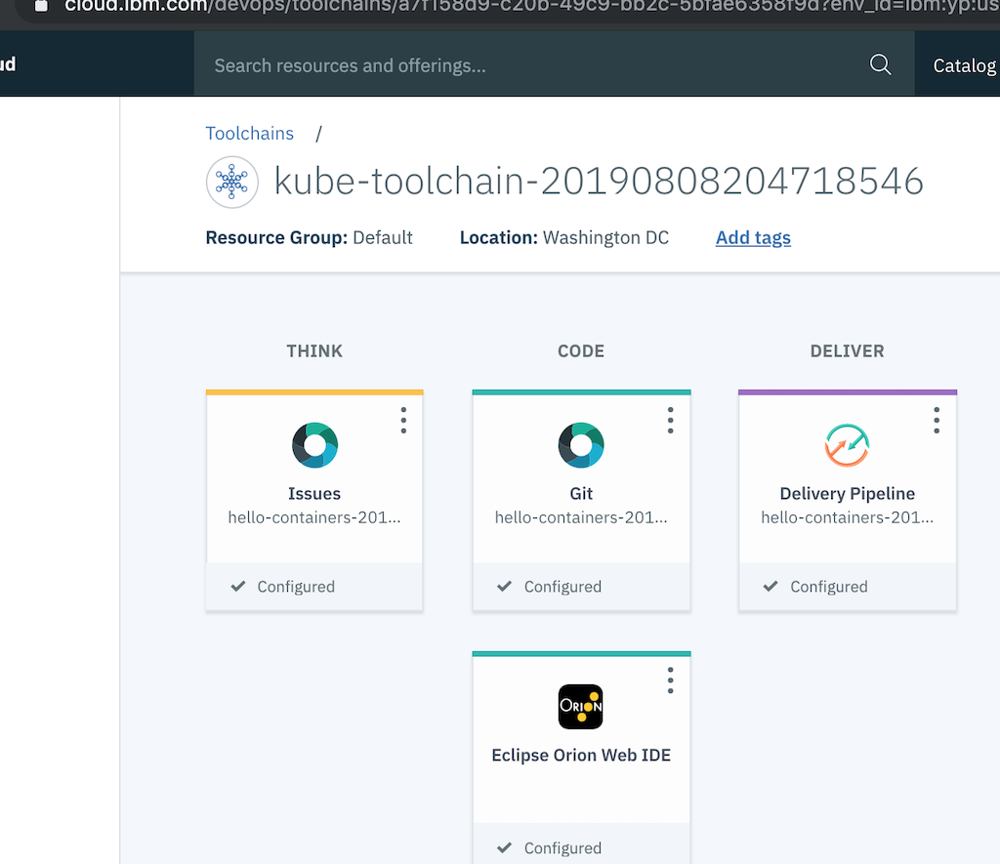
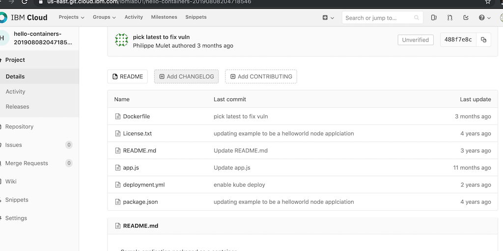
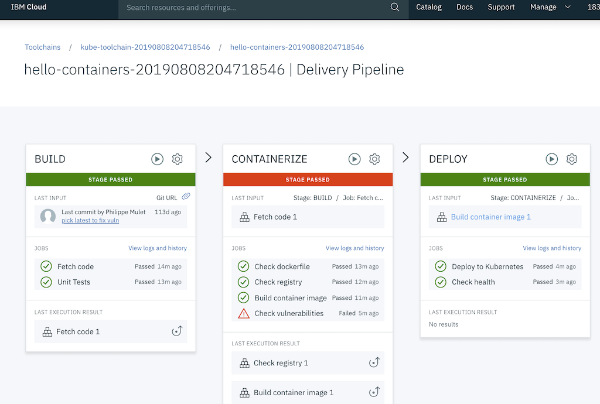
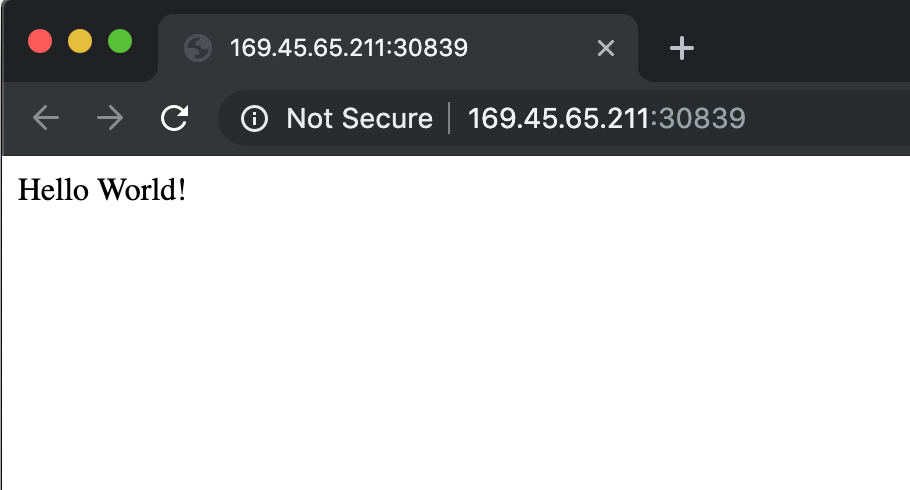

# DevOps Toolchain
Adopt a DevOps approach by using IBM® Cloud Continuous Delivery, which includes open toolchains that automate the building and deployment of applications. You can get started by creating a simple deployment toolchain that supports development, deployment, and operations tasks.

## Create a sample toolchain from an existing github repo
Create a new toolchain from a template. This template provides you with a private git repository and a pipeline which will build and deploy your application to your Kubernetes cluster automatically. 

1. Open the IBM Cloud Console and select the IBM account if it is not already selected.
2. Open the left menu by clicking on the icon in the top left corner.
3. Choose `DevOps`
4. Click on `Create a Toolchain`
5. Select `Develop a Kubernetes App`
6. Review the information provided and click on `Create`
7. Give your toolchain a name you can identify, for example `myusername-toolchain`
8. Note the `Source repository URL`. The toolchain will clone this repository in to a new private repository. 
9. Click on `Delivery Pipeline` and then `Create` next to `IBM Cloud API key`.
10. Confirm that your cluster is selected.
11. Click `Create`


## View your code and pipeline
The pipeline takes a few minutes to build and deploy your application. While that's happening, check out all the various steps.

1. Click on `Git` tile to view your private git repository. This is where your application source code will live.
   
2. Click the Back button in your browser and select `Delivery Pipeline`
3. These tiles represent the various stages of your build and deploy pipeline. Click on gear icon and then `Configure Stage` to see what each stage is doing.
4. Click on `View logs and history` on each stage to view the progress!
5. When the DEPLOY stage is complete, click on `View logs and history` and find the URL of your application at the bottom of the logs. 



## Update the code
1. Go back to the toolchains page and select the `Git` tile again
2. Open `app.js` and click `Edit`
3. Find the Welcome message near Line 22 and update it with your own message
   ```
   res.send('Hello World!');
   ```
4. Click on `Commit Changes` 
5. Go back to your Toolchain and click on `Delivery Pipeline` tile.
6. You'll notice that the pipeline is automatically running. Your app in Kubernetes should be updated in just a few moments!


