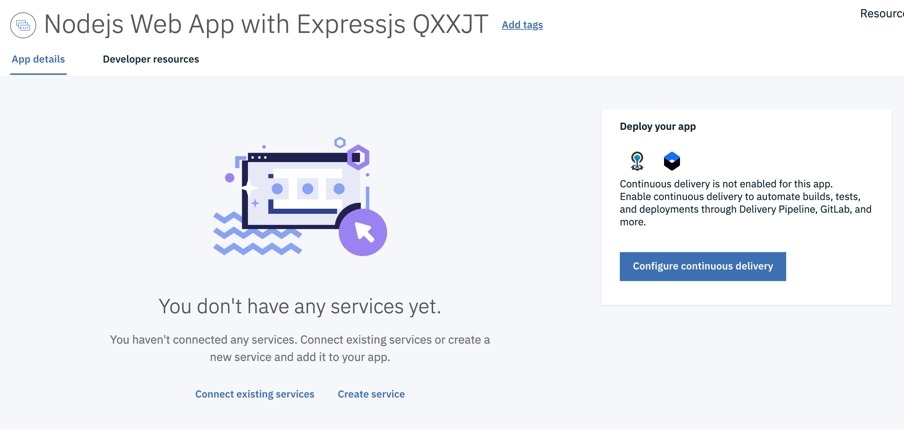
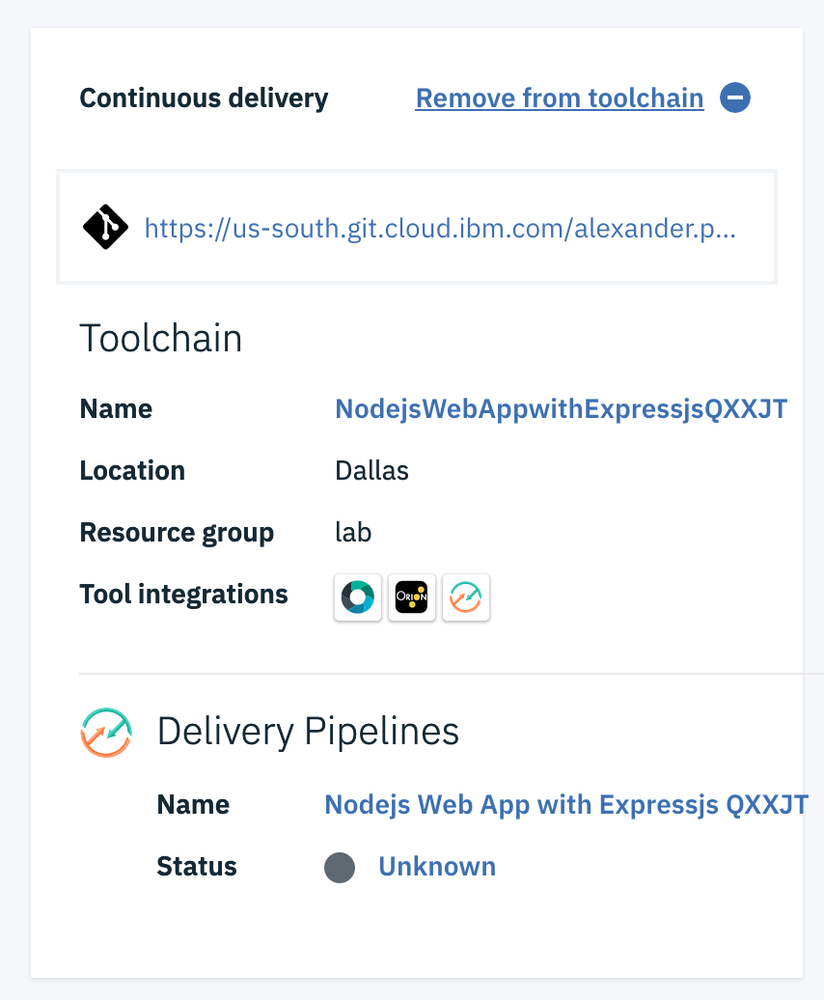
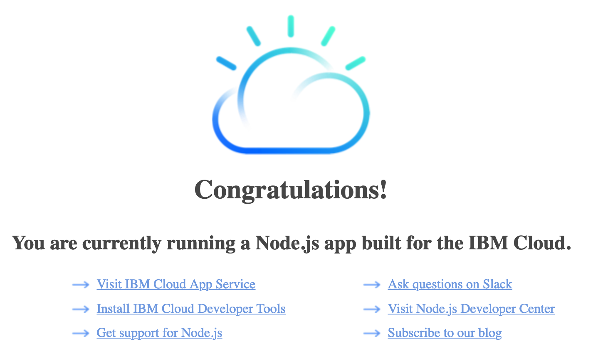

# Starter Kit
When you began this lab, the code for your first application came from an existing GitHub repository that you cloned. But for your next development project, you likely won't have a repo to clone to bootstrap your application; you'll be starting from scratch. Starter Kits are application patterns that can be integrated with services to generate a production-ready asset, which can be deployed directly into a DevOps pipeline and a Kubernetes cluster. Starter kits focus on demonstrating a key pattern implementation by using a runtime (for example, Node.js and Express). In essence, starter kits provider boilerplate to get you up and running so that you can focus on your business logic.

## Create an App from a Starter Kit
Creating an app from a Starter Kit is quite simple. Follow these steps to quickly create a Node.js web app with Express.js.

1. Open the IBM Cloud Console and select the IBM account if it is not already selected.
2. Open the left menu by clicking on the icon in the top left corner.
3. Choose `Web Apps`
4. In the `Start from the Web` pane, click `Get Started`.
5. Search for `node` and click on `Node.js Web App with Express.js`.
6. Make sure that the selected resource group is `lab`.
7. Click `create`

## Deploy Using Continuous Delivery
When you app loads, there is an option to add existing services or create new services and connect them to your app. This is a simple way to integrate IBM Cloud services into your application.

On the far right side, there is a knowledge guide. The first section of this guide concerns continuous delivery, which you will use in a moment. The second section details how to download the code for your application so that you can start developing locally.

1. Click the button that says `Configure continuous delivery`
2. Choose your assigned cluster from the dropdown. Keep the deployment type as `Helm`.
3. Click `Next`
4. Ensure that the resource group selected is `lab`.
5. Click `Create`

This will set up another toolchain for your new application. The toolchain's details should appear on the screen, as seen in the above picture. Now let's view the delivery pipeline that is a part of this toolchain, and see how we have deployed a starter kit with just a few clicks.

1. Under `Delivery Pipelines`, click on the pipeline's name to view it.
2. Wait for all three stages to complete.
3. Click the `Deploy` job in the `Deploy` stage. This will load the logs for the deployment.
4. At the bottom of the logs, click the health check link to see that your application is up and running healthily.
5. Remove the `/health` portion of the URL so that the URL is in the form `<IP_address>:<port>`. Now you'll see the starter kit's homepage.

Thanks to Starter Kits, you have nothing to worry about except coding your business logic. The boilerplate is in place for a web application. A toolchain is set up to build, test, and deploy your code, and your application is already available. And furthermore, this was all done in the IBM Cloud console with a few clicks.
